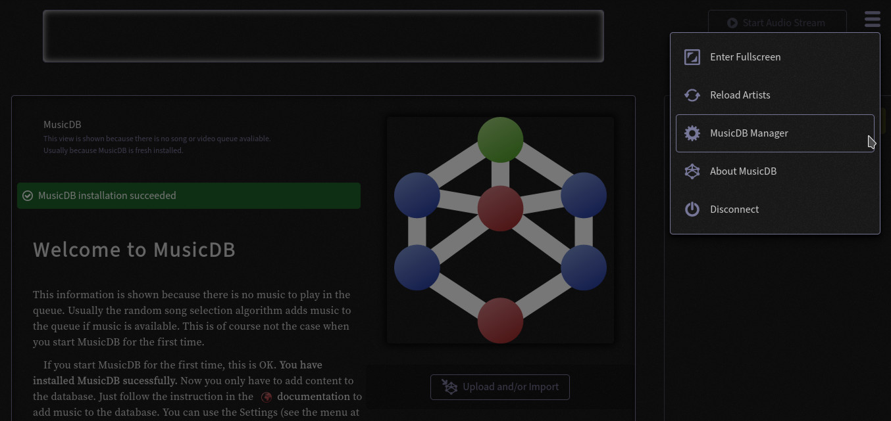
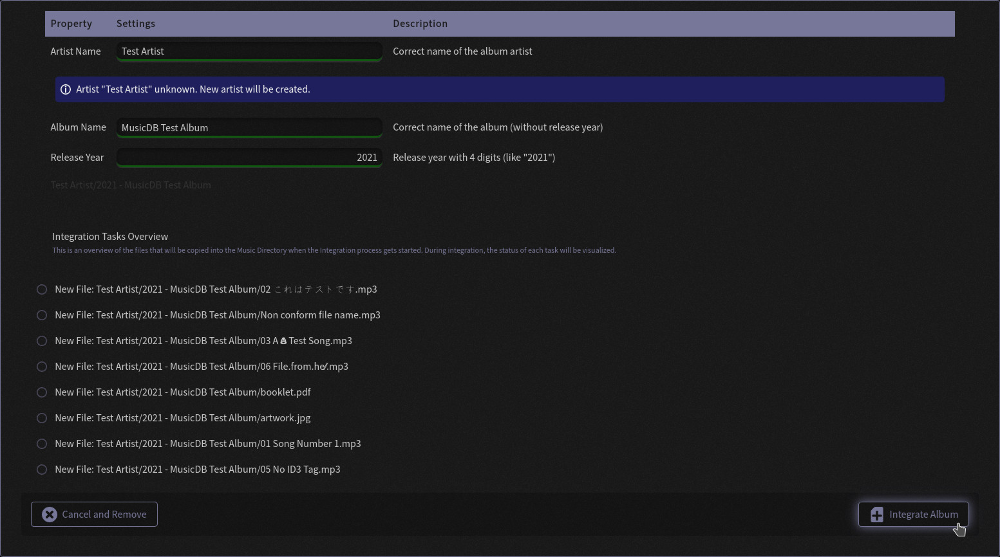
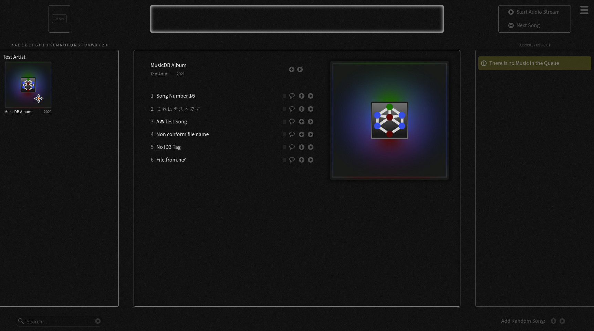

Upload and Importing Music
==========================

This chapter described how to upload and import music.

The process to get music into the MusicDB univers is split into three parts:

#. **Upload:** Uploading the music from the clients computer onto the server that runs MusicDB
#. **Integration:** Integrate the uploaded music into the Music Directory managed by MusicDB
#. **Import:** Add the files into the MusicDB Database, make them visible in the WebUI and available for the stream.

After the import, all music files follow the :ref:`Music Naming Scheme`.

The document :doc:`/basics/definitions` provides an overview of some therms used in this chapter.

The process is shown with an artificial example album to avoid violating any copyrights with the screenshots.

Open Import Manager
-------------------

To get to the MusicDB Management of the WebUI, you need to open the WebUI in the browser.
Then click on the main menu button (top right) and select the *MusicDB Manager* entry.
The Welcome-View that is shown on the first run provides a quick link to the View underneath the MusicDB Logo.

   Main menu of the WebUI. The entry to get to the MusicDB management is highlighted.

Inside the MusicDB Manager select *Import Album* in the left menu.
Then the *Upload and Import Albums* view will be shown:

.. figure:: ../images/ImportView.jpg
   :align: center

   Upload and Import view for albums. The list of new album directories is empty.

If you already have music inside your music directory with albums following the :ref:`Music Naming Scheme` concept,
the albums are listed in the *New Album Directories* list.
If not the list is empty as shown on the screenshot.

Uploading an Album
------------------

To upload a new album, click on the *Select Album Directory* button.
The browser then opens a dialog that allows you to select a directory from your computer.
All files will be uploaded to the server.

At this point, the music does not have to fulfill the naming scheme for music files.

.. figure:: ../images/UploadTest.jpg
   :align: center

   Upload progress shows that all files have been successful uploaded.
   They are ready to be integrated into the Music Directory.

After a success you can continue integrating the uploaded files into the Music Directory.
Click on the *Continue with Integration* to do so.

When you click on the *Cancel and Remove* button, the uploaded files will be removed and the process of integrating and importing the music canceled.

The *Integration* layer allows you to give the album a valid name following the :ref:`Music Naming Scheme`.

   The Integration Layer allows you to give the uploaded album valid directory names.
   You get an information if the Artist is already known by MusicDB or not.

When you set the correct name for the album and the artist, as well as a correct release year,
the album can be integrated into the Music Directory.
You can use any character available in the Unicode character set including dots, spaces, slashed and emoji.
If you use a slash (/) for a name it will be automatically replaced by a DIVISION SLASH (U+2215 - ∕ ) internal.

At the bottom of the view all steps to do by the MusicDB server are listed.
When clicking on the *Integrate Album* button, a new artist directory gets created if it does not yet exists.
Then a new album directory will be created inside the artist directory.
Last all uploaded files will be moved into the new album directory.

When you click on the *Cancel and Remove* button, the uploaded files will be removed and the process of integrating and importing the music canceled.
Nothing will be changed inside your Music Directory then.

The integration progress will be shown in a new Layer when clicking on the *Integrate Album* button.
After a successful integration you have the choice to continue with the Import process, or to close the process and import the album later.

If you decide to import the album later, it will be listed in the *New Album Directories* list of the Import View in the MusicDB Manager as mentioned above.
Clicking in an entry in this list leads you to the same album import step as clicking now on the *Continue with Import* button.

Importing an Album
------------------

The album import layer supports you to make sure that all files that shall be imported into the MusicDB database follow the :ref:`Music Naming Scheme`.
You can use any character available in the Unicode character set including dots, spaces, slashed and emoji.
If you use a slash (/) for a name it will be automatically replaced by a DIVISION SLASH (U+2215 - ∕ ) internal.
In case something is not valid, a meaningful information will be shown.

.. figure:: ../images/ImportLayer.jpg
   :align: center

   The Integration Layer allows you to give the uploaded album valid directory names.
   You get an information if the Artist is already known by MusicDB or not.

When clicking on *Import Album* the tasks listed at the end of the layer will be executed.
When clicking on *Cancel and Discard* all changed made will be discard, but no files will be deleted.
You can import the album any time later.

After you uploaded and imported one or more albums, you can go back to the MusicDB WebUI
by clicking on the *Back to Music* button at the top of the Settings Menu.

.. figure:: ../images/BackToMusic.jpg
   :align: center

   Leave the MusicDB Manager and show the music collection.

Usually when leaving the MusicDB Manager, the current playing album gets loaded and shown.
A fresh installed MusicDB does not stream any albums and so, the last shown Management view remains.
By clicking on any album in the Artists view on the left, the album will be shown as expected.

   The new uploaded album imported into MusicDB

