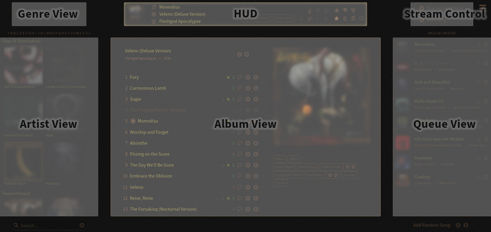
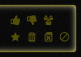
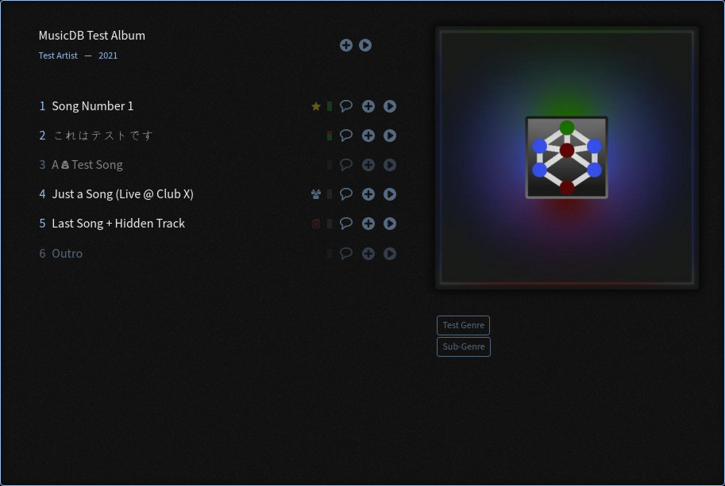
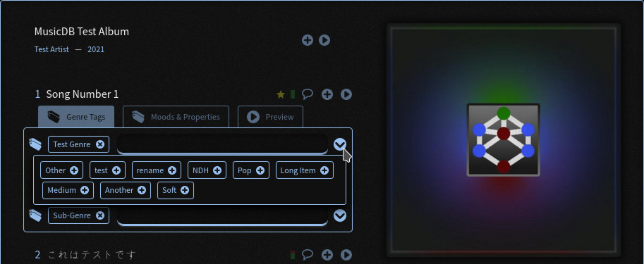

WebUI
=====

The MusicDB WebUI is the web front-end to MusicDB.
The WebUI has the following purposes:

#. Presenting the Music Collection
#. Managing the audio stream
#. Managing the Music Collection

One goal of the WebUI is, that when using it to consume music, it should not give the user the feeling to use software.
The focus is always on the music, usually visually represented by the album artwork.
The management part consisting of configuration and music upload/import can be reached via the Main Menu at the top right.

Architecture and Wording
------------------------

The WebUI has a modular architecture consisting of different Views and Layers.
A View is an exchangeable tile embedded inside the User Interface (UI).
A Layer is an overlay that is displayed on top of the UI.

The WebUI can be in different modes.
Depending on the modes, the Views of the UI change.
The following modes exist:

#. *Audio Mode*: Default mode. Your collection of music albums are presented in this mode.
#. *Video Mode*: (This mode is experimental and does not work yet)
#. *Settings Mode*: Provides several views to manage MusicDB and your Music Collection

The following sections describe the modes and their views.

WebUI in Audio Mode
-------------------

   Overview of the Views of the WebUI in Audio Mode

The screenshot highlights the different views of the WebUI.

There are some general rules that apply to all elements:

- Clicking on an Artist name scrolls the Artist View to that artist.
- Clicking on an Album Artwork shows that album in the Album View
- Album Artworks can be Drag'n'Dropped into the Queue View to add all songs of an Album

Genre View
^^^^^^^^^^

The Genre View list all genres that exist in the database.
In this view, genres can be activated or deactivated by clicking on them.

The WebUI only shows albums that have songs of an activated genre.
Furthermore the random song selection algorithm only selects songs that are of the selected genre.

Shift+Click allows an exclusive selection, so all other genres get deactivated.

Right Click on the Genre View opens an advanced genre selection view that allows to also select specific sub genres.
If only some sub genres of a main genre is selected, the corresponding genre button is shown with dashed lines.

HUD
^^^

The Head-Up-Display (HUD) Provides all information about the currently streamed song.

The left part of the HUD shows the name of the Song, Album and Artist.
The middle part lists all genres and sub-genres that are associated to that song.
The right part provides a grid of mood-flags that can be set or reset by clicking on them.
Next to the mood-flags is a grid of song properties that can also be set or reset by clicking on them.

- *Like:* Increase the Likes-Counter
- *Dislike:* Increase the Dislikes-Counter
- *Live Recording:* Flag the song when it has been recorded on stage
- *Favorite:* Mark the song as your favorite song
- *Hated:* Mark that you do not like the song
- *Deactivated:* Deactivate the song
- *Bad File:* Bad audio file (low quality, silence at the end, …)

Deactivated songs will not be considered by the random song selection algorithm.
Furthermore they will not be inserted into the queue when the whole album shall be inserted.
To learn more about the impact of the song properties see the :ref:`Album View` section.

Stream Control
^^^^^^^^^^^^^^

The Stream Control View provides two buttons to control the audio stream.

- *Start Audio Stream:* Start streaming the top song from the Song Queue.
- *Next Song:* Skip the current streaming song and play the next one in the Song Queue.

If no song is streamed, silence is streamed.
So the stream is always online.
This has the advantage that when pausing the audio stream, all clients stay connected.

Artists View
^^^^^^^^^^^^

The Artists View provides a list with all Artists and Albums of the genres selected in the Genre View.
The artists are sorted in an alphabetic order.
You can use the alphabet bar above the Artists View to jump through the list.
The albums of an artist are sorted by release date.

Clicking on an Album shows it in the Album View.
You can also drag an album and drop it into the Queue View to insert all songs of an album into the queue.

Album View
^^^^^^^^^^

The Album View is the heart of the WebUI.
It presents the selected album.
When a new song starts to get streamed, its album will automatically be opened in the Album View.

The Album View itself consist of different parts:

   An album shown in the Album View

The Album View consists of four parts.
The headline on the top left, the album artwork on the top right.
Below the headline is the songs list. Below the artwork are the genres and sub-genres of the album listed.

You can drag the album artwork and move it into the Queue View to insert all songs of the album into the queue.
You can also drag and drop individual songs from the song list into the Queue View.

Additional to the Drag'n'Drop feature you can use the two round buttons to add a song from the list at the end of the Queue, or right after the current screamed song.
With the two buttons in the headliner section you can insert a random song from the selected album into the queue.

.. figure:: ../images/AlbumContextMenu.jpg
   :align: center

   Right click on the album headline opens the album settings menu

With a right click on the headline of the album, a setting menu appears.
This menu allows you to do the following changes to the Album:

- Add or remove genre tags
- Add or remove sub-genre tags
- Upload a new album artwork
- Change the color theme connected to that album
- Hide the album (The whole album is then no longer visible in the WebUI)
- Open an advanced album settings layer that allows you to rename the album
- Open an advanced songs settings layer that allows you to rename songs of the album

   Right click on a song opens the song settings menu

When you right click on a song, a similar menu appears.
Where you can change the following song properties:

- Add or remove genre tags
- Add or remove sub-genre tags
- Changing mood-flags
- Changing song property flags
- Listen to the song directly without inserting it into the queue (Preview feature)

The mood flags and some of the song property flags are also visible in the songs list.

The Like/Dislike ration is visualized by a small box that is gray when there are no likes or dislikes.
The ratio itself is represented by a red (dislike) and green (like) part.
In the screenshot, song number 2 got two likes and one dislike.
Beside the flag icons itself, some song property flags have the further effects on the visualization.
Hated songs have a lower opacity (Song number 3 on the screenshot).
Deactivated songs are shown with even less contrast (Song number 6).

Between the song property information and the buttons to add the song into the queue is a button that shows the current state of the lyrics annotation to the song.
You can read or add lyrics to a song when clicking on them.

Queue View
^^^^^^^^^^

The Queue View shows all songs that are in the queue.
The top entry is the currently streamed song.
You can move the entries (except for the top one) via Drag'n'Drop to change their position in the queue.
New songs can be added by Dropping them into the queue.

Above the Queue View to timers are shown.
The left one is the current time, the right one tells you when the last song in the queue will be finished being streamed.

Below the Queue View are two buttons to add a random song to the Queue.
You can append one at the end of the queue or add it right after the current streamed song.
Of course only songs associated to the activated genres were considered.

Details of how to configure the random song selection algorithm can be found in :doc:`/lib/randy`.

Lyrics View
^^^^^^^^^^^

To Do.

WebUI Settings Mode
-------------------

To Do.

Random Song Selection
---------------------

To Do.

